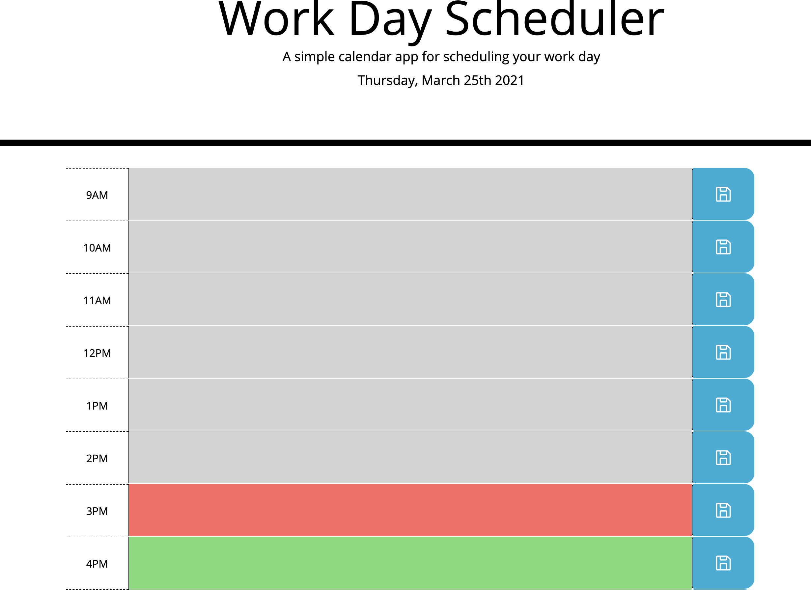

# day_Planner

This project is a daily planner that displays the current date and allows you to store your daily work schedule in the timeblocks. The timeblocks are also color coded.
Current time will be red, past time will be gray, and future is green.

(Github Repository: )[https://github.com/KeonaK/day_Planner]
(Github Deployment Link: )[https://keonak.github.io/day_Planner/]

